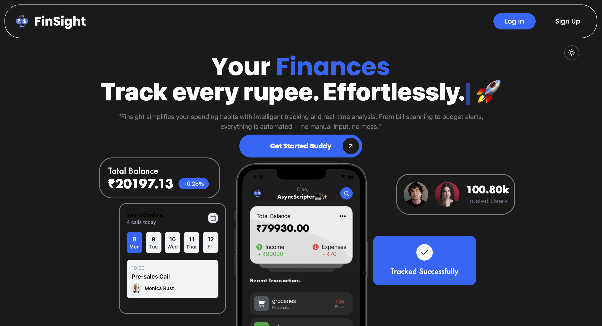
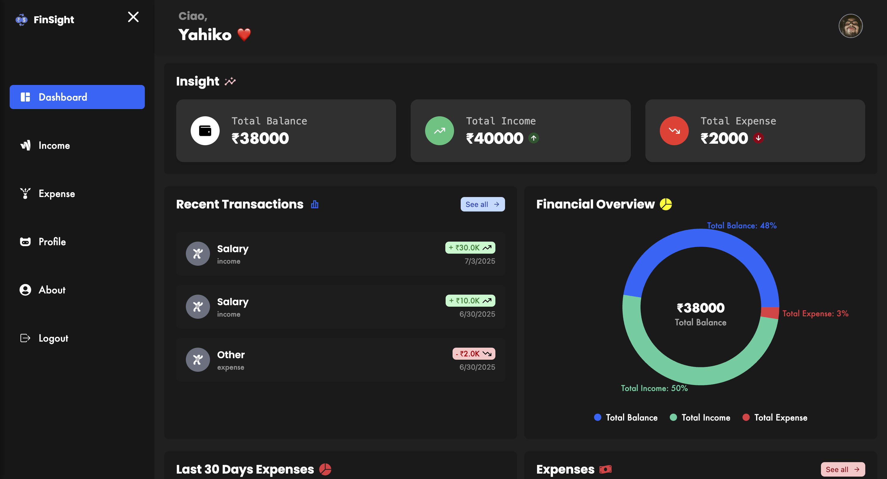
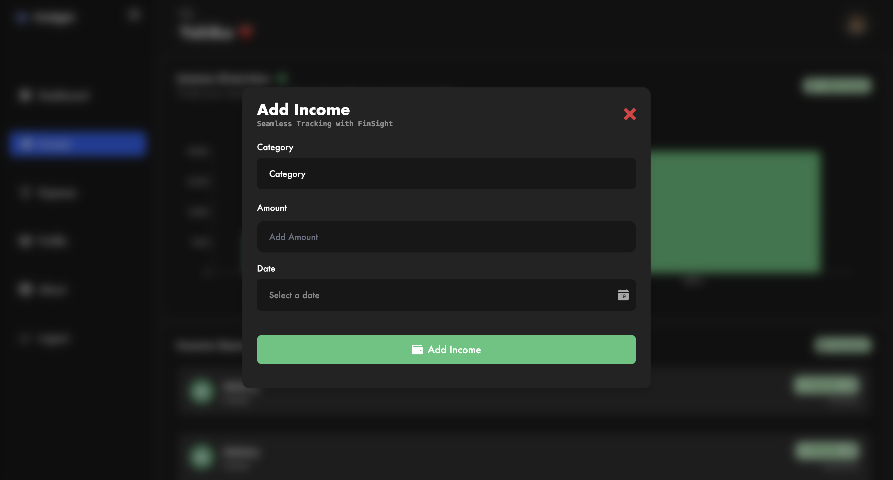
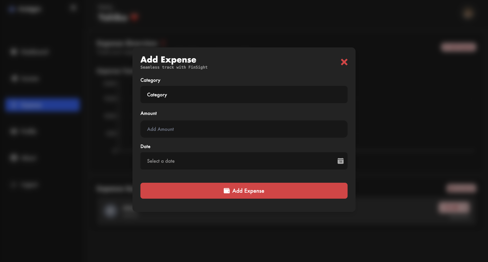

# 💰 FinSight – Personal Finance Tracker

FinSight is a powerful and intuitive web application designed to help individuals manage their income and expenses effortlessly. Whether you're a freelancer, salaried employee, or student, FinSight gives you a comprehensive view of your finances in a clean and visually engaging way.

---

## 📸 Project Preview

### 🏠 Welcome Page

### 📊 Dashboard Overview

### ➕ Add Income

### ➕ Add Expense

---

## 🚀 Features

### 🔐 Authentication
- Secure login system using email/password
- Session storage for user persistence
- Google login (optional / under development)

### 💸 Income & Expense Management
- Categorize income (freelancing, salary, trading, etc.)
- Track expenses in over **50+ categories**
- Add, edit, delete entries

### 📈 Data Visualization
- Graphs and pie charts for:
  - Monthly income vs expenses
  - Category-wise breakdown
- Color-coded UI to distinguish data types

### 📅 Calendar-based View (Coming Soon)
- Visualize financial activity based on calendar events

### 🌙 Dark Mode Support
- Toggle between light and dark themes in the welcome page only

---

## 🧠 Future Prospects

- 📱 **Mobile App** using React Native
- 🏦 **Bank API Integration** (e.g., Plaid)
- 💬 **AI-powered financial insights**
- 📥 **Export Reports** to PDF/Excel
- 👨‍👩‍👧‍👦 Shared family/group budgets
- 🔔 Expense limit alerts

---

## 🛠 Tech Stack

| Tech                     | Description                                                                 |
|--------------------------|-----------------------------------------------------------------------------|
| **MongoDB**              | NoSQL database for storing user data and transactions                      |
| **Express.js**           | Backend framework for routing and APIs                                     |
| **React**                | Frontend library for building the UI                                       |
| **Node.js**              | JavaScript runtime for server-side logic                                   |
| **JWT (JSON Web Tokens)**| Secure authentication and authorization                                     |
| **Firebase (Google Auth)**| Used specifically for Google-based authentication                        |
| **Tailwind CSS**         | Utility-first CSS framework for consistent, responsive design              |                         |
| **Recharts**  | Used for rendering financial graphs and visual data insights               |
| **Three.js**             | Core library for rendering 3D scenes on the web                            |
| **@react-three/fiber**   | React renderer for Three.js for building declarative 3D interfaces          |
| **@react-three/drei**    | Helpers and abstractions for Three.js via React                            |
| **GSAP**                 | Animation library for scroll-based and interactive transitions             |

## 👥 Team

| Name             | Role                      |
|------------------|---------------------------|
| **Subhro Kolay** | Project head & developer |
| **Chandrima Ray** | Frontend Developer |
| **Avik Bera**     | Backend Developer |
| **Ayan Das**      | UI/UX Design, Frontend |
| **Akash Maity**   | developer |
| **Bristi Danre**  | Documentation & Testing |

---
